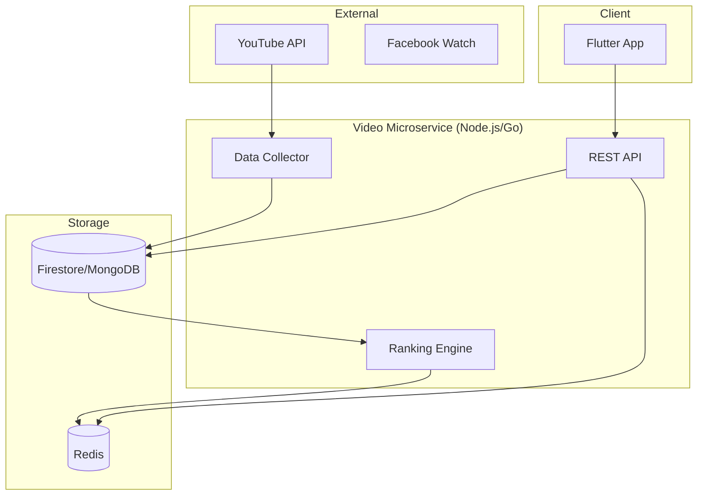

# Deep Backend Analysis: Trending Microservice

## Current State
The "Trending" section is currently powered by a client-side mock service (`TrendingVideoService`) that seeds a static list of videos into Firestore. While functional for a prototype, it lacks the scalability, dynamism, and intelligence required for a production-grade agricultural platform.

## Identified Gaps & Deficiencies

### 1. Data Source & Freshness
- **Problem**: Data is hardcoded. Farming techniques, market trends, and educational content change weekly.
- **Solution**: Implement a crawler or integration with YouTube Data API v3, filtered for verified agricultural channels (e.g., Ministry of Agriculture, Krishi Vigyan Kendra).

### 2. Ranking Algorithm (The "Trending" Logic)
- **Problem**: "Trending" is currently just a static list.
- **Solution**: Implement a time-decayed popularity score:
  `Score = (V^0.8 + L^1.2 + C^1.5) / (T + 2)^1.8`
  Where:
  - `V`: View count
  - `L`: Likes
  - `C`: Comments/Shares
  - `T`: Time since publication (in hours)

### 3. Personalization & Relevance
- **Problem**: A wheat farmer in Punjab sees the same "trending" videos as a coconut farmer in Kerala.
- **Solution**: Filter trending content based on:
  - **User Role**: Farmer, Wholesaler, or Vendor.
  - **Location**: Regional crop cycles and weather patterns.
  - **Interests**: Explicitly selected crop categories in the user profile.

### 4. Scalability & Performance
- **Problem**: Direct Firestore queries for "Trending" can be expensive and slow as the video library grows.
- **Solution**:
  - **Caching**: Use Redis to store the top 50 trending videos per region/category.
  - **CDN**: Ensure video thumbnails and metadata are cached at the edge.

### 5. Content Moderation & Quality
- **Problem**: Any video could be added, potentially including misinformation.
- **Solution**: 
  - **Expert Curation**: Admin panel for agricultural experts to "pin" verified high-quality content.
  - **AI Filtering**: Use LLMs to analyze video descriptions and transcripts for accuracy.

## Proposed Architecture

## Recommended Implementation Steps

1. **Phase 1: Backend Integration (DONE)**
   - Move video logic from Flutter to Node.js backend.
   - Create endpoints for `/trending` and `/category/:category`.

2. **Phase 2: Live Data Integration**
   - Setup a cron job to fetch 100 new videos from YouTube API daily using agricultural keywords.
   - Store metadata in Firestore with initial view counts.

3. **Phase 3: Interactive Features**
   - Add "Like" and "Watch Later" functionality.
   - Track user views to feed the ranking algorithm.

4. **Phase 4: Personalization**
   - Implement collaborative filtering to recommend videos based on "Users like you also watched".
